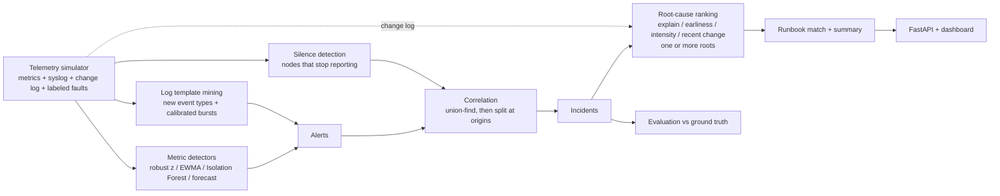

# NetOps Sentinel

AIOps for network and service telemetry: detect anomalies in metrics and logs, collapse alert storms into incidents, rank the likely root cause using the dependency topology, and recommend a runbook.

[](https://github.com/JackyJHung/netops-sentinel/actions/workflows/ci.yml)

## The problem

When a core switch starts flapping, every device and service behind it alerts at once. On-call engineers get dozens of pages, have to work out which one is the cause, and then go find the right runbook. The metrics that matter are **mean time to detect (MTTD)**, **how much alert noise reaches a human**, and **how fast the root cause is found**.

NetOps Sentinel is an end-to-end pipeline for that workflow, with a labeled simulator so every stage can be measured instead of eyeballed.

## Pipeline



| Stage | Module | What it does |
|---|---|---|
| Simulate | `simulator.py` | 10-node campus network + 3-tier app. Diurnal load, Cisco-style syslog, and four fault types (CPU saturation, link flap, memory leak, latency degradation) that cascade downstream with lag. Fault intensity varies from hard failures to subtle "gray" failures. A `hard` scenario adds concurrent faults, missing telemetry, benign changes, and a change log. |
| Detect (metrics) | `detection.py` | Robust z-score (rolling median/MAD) and an EWMA control chart that must agree, a per-node Isolation Forest on residuals, and a trend forecaster that predicts resource exhaustion. Runs are debounced into alerts. |
| Detect (logs) | `logs.py` | Masks IPs, numbers, and interface IDs, clusters lines into templates, then flags new warning+ event types, and bursts that are both large and improbable under the template's own Poisson rate. |
| Correlate | `correlation.py` | Groups alerts that overlap in time and are topologically related (union-find), then splits groups whose origins sit on unrelated branches with separate onsets. Nodes whose telemetry goes dark are attached as evidence. |
| Root cause | `rca.py` | Scores each alerting or silent node by how many other alerting nodes sit downstream of it, how early it alerted, how loud it is, and whether it was changed just before. Declares more than one root when concurrent faults share an incident. Returns a ranked list with reasons. |
| Remediate | `runbooks.py`, `data/runbooks.yaml` | Matches metric signals and log keywords on the root node to a runbook with steps and an auto-remediation hook. |
| Measure | `evaluation.py` | Precision, recall, F1, MTTD, RCA top-1/top-3, runbook classification accuracy, alert compression. Pooled over a held-out seed split with bootstrap confidence intervals, broken down by fault kind and intensity. |

## Results

Held-out test split: 30 simulated days (seeds 100-129, 1,440 min each). Thresholds were only ever tuned on a separate tuning split (seeds 0-9). Metrics are pooled over all days; brackets are 95% confidence intervals from a day-level bootstrap. Every day is run twice, once per scenario. Reproduce with `sentinel eval` (full report with per-fault-kind and per-intensity breakdowns: [`reports/benchmark-test.md`](reports/benchmark-test.md)).

### Clean scenario: one fault at a time, complete telemetry

About 9 faults per day, 273 in total.

| Configuration | Precision | Recall | F1 | MTTD (min) | RCA top-1 | Runbook match | Alerts per incident |
|---|---|---|---|---|---|---|---|
| Static thresholds (baseline) | 1.00 [1.00, 1.00] | 0.55 [0.49, 0.60] | 0.71 [0.66, 0.75] | 3.4 [2.2, 4.7] | 1.00 | 0.93 [0.89, 0.96] | 1.7 |
| Robust z + EWMA | 1.00 [1.00, 1.00] | 0.96 [0.94, 0.98] | 0.98 [0.97, 0.99] | 4.8 [3.7, 6.0] | 1.00 | 0.77 [0.71, 0.82] | 2.4 |
| + Isolation Forest | 1.00 [1.00, 1.00] | 0.98 [0.97, 1.00] | 0.99 [0.98, 1.00] | 5.2 [4.1, 6.3] | 1.00 | 0.75 [0.70, 0.80] | 2.9 |
| + Saturation forecast | 1.00 [1.00, 1.00] | 0.99 [0.98, 1.00] | 0.99 [0.99, 1.00] | 1.9 [1.5, 2.2] | 1.00 | 0.99 [0.98, 1.00] | 3.2 |
| + Log mining | 0.91 [0.89, 0.94] | 1.00 [1.00, 1.00] | 0.95 [0.94, 0.97] | 2.0 [1.6, 2.3] | 1.00 | 1.00 [0.99, 1.00] | 5.0 |
| + Incident splitting | 0.90 [0.87, 0.93] | 1.00 [1.00, 1.00] | 0.95 [0.93, 0.96] | 2.0 [1.6, 2.3] | 1.00 | 1.00 [0.99, 1.00] | 4.9 |
| + Silent-node evidence | 0.90 [0.87, 0.93] | 1.00 [1.00, 1.00] | 0.95 [0.93, 0.96] | 2.0 [1.6, 2.3] | 1.00 | 1.00 [0.99, 1.00] | 4.9 |
| + Multi-root RCA | 0.90 [0.87, 0.93] | 1.00 [1.00, 1.00] | 0.95 [0.93, 0.96] | 2.0 [1.6, 2.3] | 1.00 | 1.00 [0.99, 1.00] | 4.9 |
| + Calibrated log bursts | 1.00 [1.00, 1.00] | 1.00 [1.00, 1.00] | 1.00 [1.00, 1.00] | 2.0 [1.6, 2.3] | 1.00 | 1.00 [1.00, 1.00] | 5.4 |
| + Change events (RCA signal) | 1.00 [1.00, 1.00] | 1.00 [1.00, 1.00] | 1.00 [1.00, 1.00] | 2.0 [1.6, 2.3] | 1.00 | 1.00 [1.00, 1.00] | 5.4 |
| + Change-aware paging (full) | 1.00 [1.00, 1.00] | 1.00 [1.00, 1.00] | 1.00 [1.00, 1.00] | 2.0 [1.6, 2.3] | 1.00 | 1.00 [1.00, 1.00] | 5.4 |

What the ablation shows:

- **Static thresholds miss almost half the faults**, and the misses are not random: they catch 3% of CPU saturations and 32% of memory leaks, but every hard link flap. Subtle faults (intensity < 0.5) are caught 31% of the time.
- **The forecaster cuts MTTD from 5.2 to 1.9 min, all of it on memory leaks (22 to 8 min).** Without it, a leak is never flagged on `mem_pct`: the EWMA chart absorbs a slow ramp into its mean and variance, and robust z and EWMA must agree. The leak is only noticed late, through the latency and errors it causes, so its runbook match is 0%. With the forecaster it is 100%.
- **Log mining lifts recall to 100% and used to cost 9 points of precision.** Every false log alert came from one routine template (`WARN retrying connection to metrics-exporter`) through one rule: a burst threshold of "3 lines in 5 minutes" on a template that averages 0.2, re-tested every minute of every day. **A calibrated burst test** (the count must also be improbable under the template's own Poisson rate, at a fixed budget of 0.01 false bursts per template per node per day) removes all of them: precision 0.90 to 1.00 with the same recall and runbook match.
- **The correlation and RCA upgrades change nothing here except exposing noise.** Incident splitting separated 6 log-burst false alarms that had been hiding inside real incidents (precision 0.91 to 0.90); the calibrated burst test then removed them.
- **About 51 raw alerts a day become about 10 incidents**, each with a ranked root cause and a runbook.

### Hard scenario: concurrent faults, missing telemetry, benign events

The same 30 days with everything turned on (`SCENARIOS["hard"]` in `simulator.py`): about half of the faults get a concurrent partner on the same or an unrelated branch (13.8 faults per day, 413 in total); every series has about 3 short gaps a day; one random node blackout a day; half of the hard network faults knock the device off the monitoring network; about 3 benign config pushes or rolling restarts a day cause short, real spikes; and a change log records deploys and config pushes: 40% of faults follow a change on their root, 80% of benign events are logged, and about 4 harmless changes a day land at random.

| Configuration | Precision | Recall | MTTD (min) | RCA top-1 | RCA top-3 | Runbook match | Wrong merges | Benign paged |
|---|---|---|---|---|---|---|---|---|
| Static thresholds (baseline) | 0.90 [0.85, 0.94] | 0.56 [0.51, 0.62] | 3.7 [2.6, 4.8] | 0.82 [0.75, 0.89] | 0.87 [0.82, 0.92] | 0.73 [0.68, 0.79] | 0.81 [0.60, 1.00] | 0.25 [0.16, 0.36] |
| Robust z + EWMA | 0.77 [0.73, 0.81] | 0.94 [0.91, 0.95] | 3.7 [2.9, 4.6] | 0.83 [0.79, 0.88] | 0.90 [0.87, 0.94] | 0.60 [0.56, 0.65] | 0.80 [0.64, 0.94] | 1.00 [1.00, 1.00] |
| + Isolation Forest | 0.77 [0.73, 0.82] | 0.97 [0.95, 0.98] | 3.9 [3.2, 4.6] | 0.82 [0.78, 0.87] | 0.91 [0.87, 0.94] | 0.57 [0.53, 0.62] | 0.83 [0.70, 0.94] | 1.00 [1.00, 1.00] |
| + Saturation forecast | 0.77 [0.73, 0.81] | 0.98 [0.96, 0.99] | 1.6 [1.4, 1.9] | 0.83 [0.80, 0.88] | 0.91 [0.88, 0.94] | 0.71 [0.68, 0.76] | 0.87 [0.74, 0.96] | 1.00 [1.00, 1.00] |
| + Log mining | 0.72 [0.68, 0.77] | 0.99 [0.99, 1.00] | 1.7 [1.5, 1.9] | 0.84 [0.80, 0.88] | 0.91 [0.88, 0.94] | 0.70 [0.66, 0.74] | 0.92 [0.84, 0.99] | 1.00 [1.00, 1.00] |
| + Incident splitting | 0.75 [0.71, 0.79] | 0.99 [0.99, 1.00] | 1.8 [1.5, 2.0] | 0.85 [0.81, 0.89] | 0.91 [0.88, 0.94] | 0.78 [0.75, 0.82] | 0.20 [0.11, 0.30] | 1.00 [1.00, 1.00] |
| + Silent-node evidence | 0.76 [0.71, 0.80] | 0.99 [0.99, 1.00] | 1.8 [1.5, 2.0] | 0.94 [0.92, 0.97] | 1.00 [1.00, 1.00] | 0.75 [0.71, 0.80] | 0.06 [0.01, 0.12] | 1.00 [1.00, 1.00] |
| + Multi-root RCA | 0.76 [0.71, 0.80] | 0.99 [0.99, 1.00] | 1.8 [1.5, 2.0] | 0.96 [0.94, 0.98] | 1.00 [1.00, 1.00] | 0.83 [0.79, 0.87] | 0.06 [0.01, 0.12] | 1.00 [1.00, 1.00] |
| + Calibrated log bursts | 0.80 [0.76, 0.84] | 0.99 [0.99, 1.00] | 1.8 [1.5, 2.0] | 0.97 [0.95, 0.98] | 1.00 [1.00, 1.00] | 0.83 [0.80, 0.87] | 0.06 [0.01, 0.12] | 1.00 [1.00, 1.00] |
| + Change events (RCA signal) | 0.80 [0.76, 0.84] | 0.99 [0.99, 1.00] | 1.8 [1.5, 2.0] | 0.98 [0.96, 0.99] | 1.00 [1.00, 1.00] | 0.83 [0.79, 0.88] | 0.06 [0.01, 0.12] | 1.00 [1.00, 1.00] |
| + Change-aware paging (full) | 0.96 [0.95, 0.98] | 0.99 [0.99, 1.00] | 4.7 [4.3, 5.1] | 0.98 [0.96, 0.99] | 1.00 [1.00, 1.00] | 0.83 [0.79, 0.88] | 0.06 [0.01, 0.12] | 0.14 [0.08, 0.22] |

RCA is scored per fault: a fault is a top-1 hit if its root is first in the incident that carries its evidence, once the roots of *other* faults in that incident are set aside. Under the older per-incident metric (one root per incident, so a merged pair always loses one fault) the log-mining row scores 0.62; the metric change alone accounts for 0.62 to 0.84, and the pipeline changes for 0.84 to 0.96. Wrong merges: share of concurrent faults on unrelated branches that ended up in one incident.

What breaks, and what fixed it:

- **Concurrent faults get chained into one incident** through the services they both feed (almost everything feeds `web-1`): 92% of unrelated concurrent pairs were merged. **Incident splitting** finds each group's origins (nodes with no earlier-alerting upstream node) and splits origins that share no dependency path and started more than a minute apart: wrong merges drop to 20%.
- **A switch that goes dark hides the root.** Its metrics are NaN and its logs stop, so it never alerts, and the ranker picked one of its children. **Silent-node evidence** turns "every metric of this node went missing just before its dependents alerted" into an RCA candidate and a splitting origin: top-1 0.85 to 0.94, top-3 to 1.00, wrong merges to 6%.
- **Merged same-branch faults need two answers.** **Multi-root RCA** declares a second root when the first cannot explain it (an unrelated branch, or CPU/memory symptoms, which do not cascade downstream), puts declared roots first, and matches a runbook per root: runbook match 0.75 to 0.83, top-1 to 0.96. 43 of the 46 extra roots it declares are real roots of concurrent faults.
- **Log-burst false alarms are gone** (calibrated burst test, see the clean scenario): precision 0.76 to 0.80.
- **A change just before a node alerts is evidence.** The change log (deploys, config pushes) is attached to incidents: a change on a node in the 15 min before it alerted adds to its RCA score, counts as local evidence for declaring a second root, and is named in the summary. For the 158 faults that were caused by a change, top-1 goes 0.95 to 0.99 and runbook match 0.83 to 0.87. It is not free: harmless changes near incidents add a few false extra roots (extra-root precision 0.98 to 0.92), which the tuning split did not show.
- **Change-aware paging stops benign pages, at a price in detection time.** When a recorded change hit an incident's node just before it started, the page is held for 8 min and dropped if every alert has cleared (a rolling restart recovers, a bad deploy does not). Precision 0.80 to 0.96, benign events paged 100% to 14% (most of the rest were never logged as changes), recall unchanged, and none of the 71 suppressed incidents was a real fault. The cost: faults caused by a change page about 8 min after onset instead of 1.7, and faults that share an incident with one wait too (other faults 1.8 to 2.6 min). Turn it off with `PipelineConfig(change_hold=0)` if that trade is wrong for you.
- **Missing telemetry does not cause false alerts or blind the detectors**: every detector treats a missing point as "no evidence" ([DESIGN D10](docs/DESIGN.md)).

How the numbers are produced (details and alternatives in [`docs/DESIGN.md`](docs/DESIGN.md)):

- **Tuning and test seeds are disjoint.** `sentinel eval --split tune` (seeds 0-9) is for development. `sentinel eval` (the test split) is only run to report results. CI benchmarks the tuning split so held-out numbers are not in front of us on every push.
- **Pooled, not averaged per day.** Recall is all detected faults divided by all faults; precision is all matched incidents divided by all incidents.
- **Day-level bootstrap.** Faults on the same day share telemetry, so the day is the independent unit: resample whole days, recompute, take the 2.5th and 97.5th percentiles.
- **A fault only counts as detected on its own evidence** (an alert on its root, or its root going silent), and MTTD is measured to the first alert in its own blast radius. Otherwise a concurrent fault gets credit for its neighbour's incident.

## Quick start

```bash
git clone https://github.com/JackyJHung/netops-sentinel.git
cd netops-sentinel
python -m venv .venv && source .venv/bin/activate
pip install -e ".[dev]"

pytest -q                          # unit + end-to-end + API tests
sentinel run --seed 42 -v          # simulate a day, print incidents, runbooks, and score
sentinel run --seed 5 --scenario hard   # concurrent faults, gaps, benign events
sentinel eval --split tune         # benchmark on the tuning seeds (use this while developing)
sentinel eval                      # held-out test split -> reports/benchmark-test.{md,json}
sentinel export --out data/        # metrics.csv, syslog.log, faults.json, benign_and_blackouts.json, changes.json
sentinel serve                     # API + dashboard at http://127.0.0.1:8000
```

Or with Docker: `docker build -t netops-sentinel . && docker run -p 8000:8000 netops-sentinel`

Example output (hard scenario, seed 4): two concurrent CPU faults, one of them caused by a config push, both named, each with its runbook:

```
[INC-0008] CRITICAL incident INC-0008: 7 alerts across 2 node(s) from 13:05 to 13:42. Most likely root
cause: access-sw-2 (score 1.136; config push to access-sw-2 4 min before first alert; first alert at +12 min;
upstream of 1 other alerting node(s): web-1). Suggested runbook: RB-CPU (Control-plane / worker CPU
saturation). Concurrent root cause: web-1 (score 0.55; first alert at +0 min; local evidence (CPU/memory or a
recent change) does not cascade); runbook RB-CPU. Recent change: config push to access-sw-2 at 13:13, 4 min
before first alert.
```

Ground truth for that window: `F005` CPU saturation on `web-1` at 13:05, and `F005b` CPU saturation on `access-sw-2` at 13:17, caused by change `C007` (config push to `access-sw-2` at 13:13).

## API

| Method | Path | Returns |
|---|---|---|
| GET | `/health` | liveness |
| POST | `/simulate` | re-run on a new day: `{"seed": 7, "minutes": 1440, "config": "sentinel" \| "static", "scenario": "clean" \| "hard"}` |
| GET | `/incidents` | incident list with root cause and runbook |
| GET | `/incidents/{id}` | full incident: alert timeline, ranked candidates, runbook steps |
| GET | `/faults` | injected ground truth |
| GET | `/ground-truth` | faults, benign events, telemetry blackouts, and the change log with what each change caused |
| GET | `/evaluation` | scores for the current run |
| GET | `/series/{node}/{metric}` | raw telemetry for charting |
| GET | `/topology` | dependency graph |
| GET | `/` | dashboard |

Interactive docs at `/docs`.

## Design notes

- **Two detectors must agree.** Robust z-score and EWMA each have failure modes (MAD collapses on flat series; EWMA drifts). Requiring both cuts false positives without hurting recall much.
- **EWMA freezes its baseline during anomalies** so a 40-minute incident is not slowly learned as "normal."
- **Isolation Forest runs on residuals, not raw values.** Trained on raw metrics, it flagged every afternoon as anomalous because the warm-up window only covered night-time load.
- **Per-metric noise floors** stop near-zero series (packet loss) from turning tiny wiggles into huge z-scores.
- **RCA uses topology, not just timing.** A node that explains the other alerts (they are all downstream of it) outranks one that merely alerted first.
- **Silence is evidence.** A switch that stops reporting while everything below it alerts is the likely root, not a gap to ignore.
- **Symptoms that do not cascade point to a second root.** CPU or memory saturation, or a change made to a node just before it alerted, cannot come from an upstream fault.
- **Burst thresholds come from a false-alarm budget,** not a fixed count: a test that runs 1,440 times a day will fire by chance unless its threshold accounts for that.
- **Everything is scored against ground truth.** Each design change above was kept or dropped based on the benchmark, not intuition.

## Limitations

- Telemetry is synthetic. The hard scenario adds concurrent faults, missing data, and benign spikes, but not clock skew or truly messy logs.
- Same-branch concurrent faults are still sometimes ranked second or third (top-1 0.96, top-3 1.00): a downstream fault with only cascading symptoms (latency, errors) looks like part of the upstream one.
- The unrelated-branch sample is small: 64 concurrent unrelated pairs on the test split, 13 on the tuning split, so the wrong-merge CI is wide.
- Change-aware paging only helps changes that are in the change log (14% of benign events still page), adds about 6 min of detection delay to change-caused faults, and on the tuning split suppressed one real fault: a subtle change-induced link flap whose alerts lasted 5 min looks exactly like a benign blip.
- The burst test assumes Poisson log rates. Real logs are burstier (overdispersed), so the budget would need re-checking on real data, possibly with a negative-binomial tail or per-template seasonality.
- The EWMA control chart absorbs slow ramps into its baseline, so memory leaks are only caught by the forecaster ([DESIGN D5](docs/DESIGN.md)).
- Batch processing over a full day; not yet streaming.

## Roadmap

- [x] Concurrent faults and missing-telemetry scenarios to stress RCA
- [ ] Streaming mode (Kafka or Redis Streams) with online detectors
- [ ] Ingest real data: Prometheus / OpenTelemetry metrics, syslog over UDP
- [x] Change-event correlation (deploys, config pushes) as a root-cause signal
- [x] Change-aware paging: hold a page briefly after a recorded change and drop it if the anomaly clears
- [ ] LLM-drafted incident summaries and postmortems, grounded in the alert timeline
- [ ] Human-in-the-loop auto-remediation with approval and rollback
- [ ] Grafana dashboard and Prometheus exporter for Sentinel's own metrics

## Project layout

```
src/sentinel/
  topology.py      dependency graph (upstream/downstream, hop distance)
  simulator.py     telemetry + log generator with labeled fault injection
  detection.py     static, robust z, EWMA, forecast, Isolation Forest -> alerts
  logs.py          template mining and log anomaly alerts
  correlation.py   alerts -> incidents
  rca.py           root-cause ranking
  runbooks.py      runbook matching and summaries
  pipeline.py      wires the stages together
  evaluation.py    scoring and benchmark
  api.py           FastAPI service
  cli.py           `sentinel` command
  data/            topology.yaml, runbooks.yaml
  static/          dashboard
tests/             unit + end-to-end + API tests
reports/           benchmark reports per split (markdown + JSON)
scripts/           diagnose.py: attribute false positives and RCA misses to causes
docs/DESIGN.md     decision log: what was tried, the numbers, what was kept
```

## License

MIT
