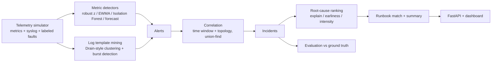

# NetOps Sentinel

AIOps for network and service telemetry: detect anomalies in metrics and logs, collapse alert storms into incidents, rank the likely root cause using the dependency topology, and recommend a runbook.

[](https://github.com/JackyJHung/netops-sentinel/actions/workflows/ci.yml)

## The problem

When a core switch starts flapping, every device and service behind it alerts at once. On-call engineers get dozens of pages, have to work out which one is the cause, and then go find the right runbook. The metrics that matter are **mean time to detect (MTTD)**, **how much alert noise reaches a human**, and **how fast the root cause is found**.

NetOps Sentinel is an end-to-end pipeline for that workflow, with a labeled simulator so every stage can be measured instead of eyeballed.

## Pipeline



| Stage | Module | What it does |
|---|---|---|
| Simulate | `simulator.py` | 10-node campus network + 3-tier app. Diurnal load, Cisco-style syslog, and four fault types (CPU saturation, link flap, memory leak, latency degradation) that cascade downstream with lag. Fault intensity varies from hard failures to subtle "gray" failures. |
| Detect (metrics) | `detection.py` | Robust z-score (rolling median/MAD) and an EWMA control chart that must agree, a per-node Isolation Forest on residuals, and a trend forecaster that predicts resource exhaustion. Runs are debounced into alerts. |
| Detect (logs) | `logs.py` | Masks IPs, numbers, and interface IDs, clusters lines into templates, then flags new warning+ event types and bursts above the warm-up rate. |
| Correlate | `correlation.py` | Groups alerts that overlap in time and are topologically related (union-find). |
| Root cause | `rca.py` | Scores each alerting node by how many other alerting nodes sit downstream of it, how early it alerted, and how loud it is. Returns a ranked list with reasons. |
| Remediate | `runbooks.py`, `data/runbooks.yaml` | Matches metric signals and log keywords on the root node to a runbook with steps and an auto-remediation hook. |
| Measure | `evaluation.py` | Precision, recall, F1, MTTD, RCA top-1/top-3, runbook classification accuracy, alert compression. Pooled over a held-out seed split with bootstrap confidence intervals, broken down by fault kind and intensity. |

## Results

Held-out test split: 30 simulated days (seeds 100-129, 1,440 min each, about 9 injected faults per day, 273 faults in total). Thresholds were only ever tuned on a separate tuning split (seeds 0-9). Metrics are pooled over all days; brackets are 95% confidence intervals from a day-level bootstrap. Reproduce with `sentinel eval` (full report with per-fault-kind and per-intensity breakdowns: [`reports/benchmark-test.md`](reports/benchmark-test.md)).

| Configuration | Precision | Recall | F1 | MTTD (min) | RCA top-1 | Runbook match | Alerts per incident |
|---|---|---|---|---|---|---|---|
| Static thresholds (baseline) | 1.00 [1.00, 1.00] | 0.55 [0.49, 0.60] | 0.71 [0.66, 0.75] | 3.4 [2.2, 4.7] | 1.00 | 0.93 [0.89, 0.96] | 1.7 |
| Robust z + EWMA | 1.00 [1.00, 1.00] | 0.96 [0.94, 0.98] | 0.98 [0.97, 0.99] | 4.8 [3.7, 6.0] | 1.00 | 0.77 [0.71, 0.82] | 2.4 |
| + Isolation Forest | 1.00 [1.00, 1.00] | 0.98 [0.97, 1.00] | 0.99 [0.98, 1.00] | 5.2 [4.1, 6.3] | 1.00 | 0.75 [0.70, 0.80] | 2.9 |
| + Saturation forecast | 1.00 [1.00, 1.00] | 0.99 [0.98, 1.00] | 0.99 [0.99, 1.00] | 1.9 [1.5, 2.2] | 1.00 | 0.99 [0.98, 1.00] | 3.2 |
| + Log mining (full) | 0.91 [0.89, 0.94] | 1.00 [1.00, 1.00] | 0.95 [0.94, 0.97] | 2.0 [1.6, 2.3] | 1.00 | 1.00 [0.99, 1.00] | 5.0 |

What the ablation shows:

- **Static thresholds miss almost half the faults**, and the misses are not random: they catch 3% of CPU saturations and 32% of memory leaks, but every hard link flap. Subtle faults (intensity < 0.5) are caught 31% of the time.
- **The forecaster cuts MTTD from 5.2 to 1.9 min, all of it on memory leaks (22 to 8 min).** Without it, a leak is never flagged on `mem_pct`: the EWMA chart absorbs a slow ramp into its mean and variance, and robust z and EWMA must agree. The leak is only noticed late, through the latency and errors it causes, so its runbook match is 0%. With the forecaster it is 100%.
- **Log mining is a trade-off.** It lifts recall to 100%, but costs 9 points of precision on the held-out days (6 on the tuning days) from log bursts that are not tied to a fault. Fixing that is on the roadmap.
- **About 51 raw alerts a day become about 10 incidents**, each with a ranked root cause and a runbook.
- **RCA scores 1.00 because every fault happens alone.** That number says little until faults overlap; see Limitations.

How the numbers are produced (details and alternatives in [`docs/DESIGN.md`](docs/DESIGN.md)):

- **Tuning and test seeds are disjoint.** `sentinel eval --split tune` (seeds 0-9) is for development. `sentinel eval` (the test split) is only run to report results. CI benchmarks the tuning split so held-out numbers are not in front of us on every push.
- **Pooled, not averaged per day.** Recall is all detected faults divided by all faults; precision is all matched incidents divided by all incidents.
- **Day-level bootstrap.** Faults on the same day share telemetry, so the day is the independent unit: resample whole days, recompute, take the 2.5th and 97.5th percentiles.

## Quick start

```bash
git clone https://github.com/JackyJHung/netops-sentinel.git
cd netops-sentinel
python -m venv .venv && source .venv/bin/activate
pip install -e ".[dev]"

pytest -q                          # unit + end-to-end + API tests
sentinel run --seed 42 -v          # simulate a day, print incidents, runbooks, and score
sentinel eval --split tune         # benchmark on the tuning seeds (use this while developing)
sentinel eval                      # held-out test split -> reports/benchmark-test.{md,json}
sentinel export --out data/        # metrics.csv, syslog.log, faults.json
sentinel serve                     # API + dashboard at http://127.0.0.1:8000
```

Or with Docker: `docker build -t netops-sentinel . && docker run -p 8000:8000 netops-sentinel`

Example output:

```
[INC-0001] CRITICAL incident INC-0001: 10 alerts across 4 node(s) from 04:04 to 04:23.
Most likely root cause: access-sw-2 (score 1.0; first alert at +0 min; upstream of 3 other
alerting node(s): api-1, cache-1, web-1). Suggested runbook: RB-LINK (Interface flapping /
link instability). Impacted: api-1, cache-1, web-1.
```

## API

| Method | Path | Returns |
|---|---|---|
| GET | `/health` | liveness |
| POST | `/simulate` | re-run on a new day: `{"seed": 7, "minutes": 1440, "config": "sentinel" \| "static"}` |
| GET | `/incidents` | incident list with root cause and runbook |
| GET | `/incidents/{id}` | full incident: alert timeline, ranked candidates, runbook steps |
| GET | `/faults` | injected ground truth |
| GET | `/evaluation` | scores for the current run |
| GET | `/series/{node}/{metric}` | raw telemetry for charting |
| GET | `/topology` | dependency graph |
| GET | `/` | dashboard |

Interactive docs at `/docs`.

## Design notes

- **Two detectors must agree.** Robust z-score and EWMA each have failure modes (MAD collapses on flat series; EWMA drifts). Requiring both cuts false positives without hurting recall much.
- **EWMA freezes its baseline during anomalies** so a 40-minute incident is not slowly learned as "normal."
- **Isolation Forest runs on residuals, not raw values.** Trained on raw metrics, it flagged every afternoon as anomalous because the warm-up window only covered night-time load.
- **Per-metric noise floors** stop near-zero series (packet loss) from turning tiny wiggles into huge z-scores.
- **RCA uses topology, not just timing.** A node that explains the other alerts (they are all downstream of it) outranks one that merely alerted first.
- **Everything is scored against ground truth.** Each design change above was kept or dropped based on the benchmark, not intuition.

## Limitations

- Telemetry is synthetic. Real networks have missing data, clock skew, and far messier logs.
- Faults happen one at a time, and the topology is clean, so RCA scores are optimistic. Concurrent and overlapping faults are the next test.
- Log-burst alerts cost some precision (see results).
- The EWMA control chart absorbs slow ramps into its baseline, so memory leaks are only caught by the forecaster ([DESIGN D5](docs/DESIGN.md)).
- Batch processing over a full day; not yet streaming.

## Roadmap

- [ ] Concurrent faults and missing-telemetry scenarios to stress RCA
- [ ] Streaming mode (Kafka or Redis Streams) with online detectors
- [ ] Ingest real data: Prometheus / OpenTelemetry metrics, syslog over UDP
- [ ] Change-event correlation (deploys, config pushes) as a root-cause signal
- [ ] LLM-drafted incident summaries and postmortems, grounded in the alert timeline
- [ ] Human-in-the-loop auto-remediation with approval and rollback
- [ ] Grafana dashboard and Prometheus exporter for Sentinel's own metrics

## Project layout

```
src/sentinel/
  topology.py      dependency graph (upstream/downstream, hop distance)
  simulator.py     telemetry + log generator with labeled fault injection
  detection.py     static, robust z, EWMA, forecast, Isolation Forest -> alerts
  logs.py          template mining and log anomaly alerts
  correlation.py   alerts -> incidents
  rca.py           root-cause ranking
  runbooks.py      runbook matching and summaries
  pipeline.py      wires the stages together
  evaluation.py    scoring and benchmark
  api.py           FastAPI service
  cli.py           `sentinel` command
  data/            topology.yaml, runbooks.yaml
  static/          dashboard
tests/             unit + end-to-end + API tests
reports/           benchmark reports per split (markdown + JSON)
docs/DESIGN.md     decision log: what was tried, the numbers, what was kept
```

## License

MIT
